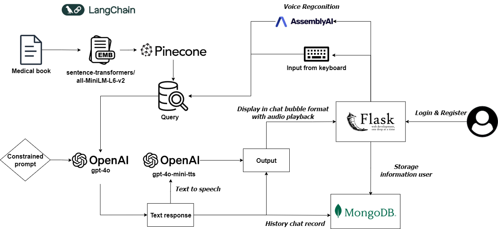

# 🩺 Medical Chatbot  

A **medical assistant chatbot** powered by **Retrieval-Augmented Generation (RAG)** and **voice interaction** for natural, context-grounded conversations.  
The system is designed to provide reliable medical information retrieval from curated documents while supporting both **text** and **voice-based communication**.  


## 📊 System Pipeline  



1. **Knowledge Base**  
   Medical documents are embedded using `sentence-transformers/all-MiniLM-L6-v2` and stored in **Pinecone** for efficient semantic search.  

2. **User Interaction**  
   Users can submit queries via **keyboard input** or **speech**.  

3. **RAG with GPT-4o**  
   The chatbot uses a **RAG pipeline** to combine document retrieval with generative reasoning, ensuring accurate, grounded responses.  

4. **Response Delivery**  
   Answers are displayed in a **chat bubble UI** and can also be played back using **Text-to-Speech (TTS)** for a natural experience.  

5. **Data Persistence**  
   **MongoDB** stores user profiles and chat history for personalization and continuity.  

---

## 🎥 Demo  
<p align="center">
  <a href="https://youtu.be/dyRZdyNx1p0">
    <img src="https://img.youtube.com/vi/dyRZdyNx1p0/0.jpg" alt="Watch the demo" style="width:480px; xxxxxxxxxxxxxxxxxxxxxxxxxxxxx'
LANGCHAIN_API_KEY='xxxxxxxxxxxxxxxxxxxxxxxxxxxxx'
LANGCHAIN_TRACING_V2=true
LANGCHAIN_PROJECT=medical-chatbot
```

### Step 4 – Build the Vector Index

Run the following command to process documents and store embeddings in Pinecone:

```bash
python store_index.py
```

### Step 5 – Launch the Application

Finally, start the chatbot server:

```bash
python app.py
```


